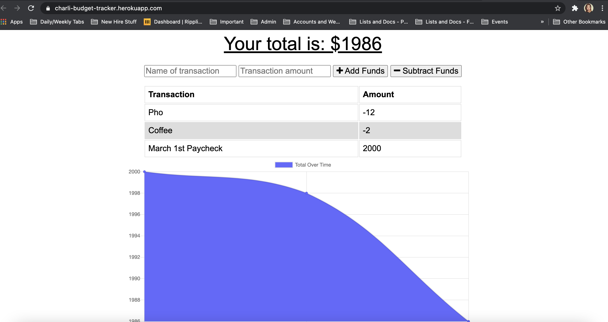

# HW_18_Offline_Budget_Tracker

## About
For this assignment, we were required to add functionality to our existing Budget Tracker application to allow for offline access and functionality. This involved work with service workers, MongoDB, Javascript, etc. 

## Screenshots

## Links
https://charli-budget-tracker.herokuapp.com/

https://github.com/charlispilecki/HW_18_Offline_Budget_Tracker
